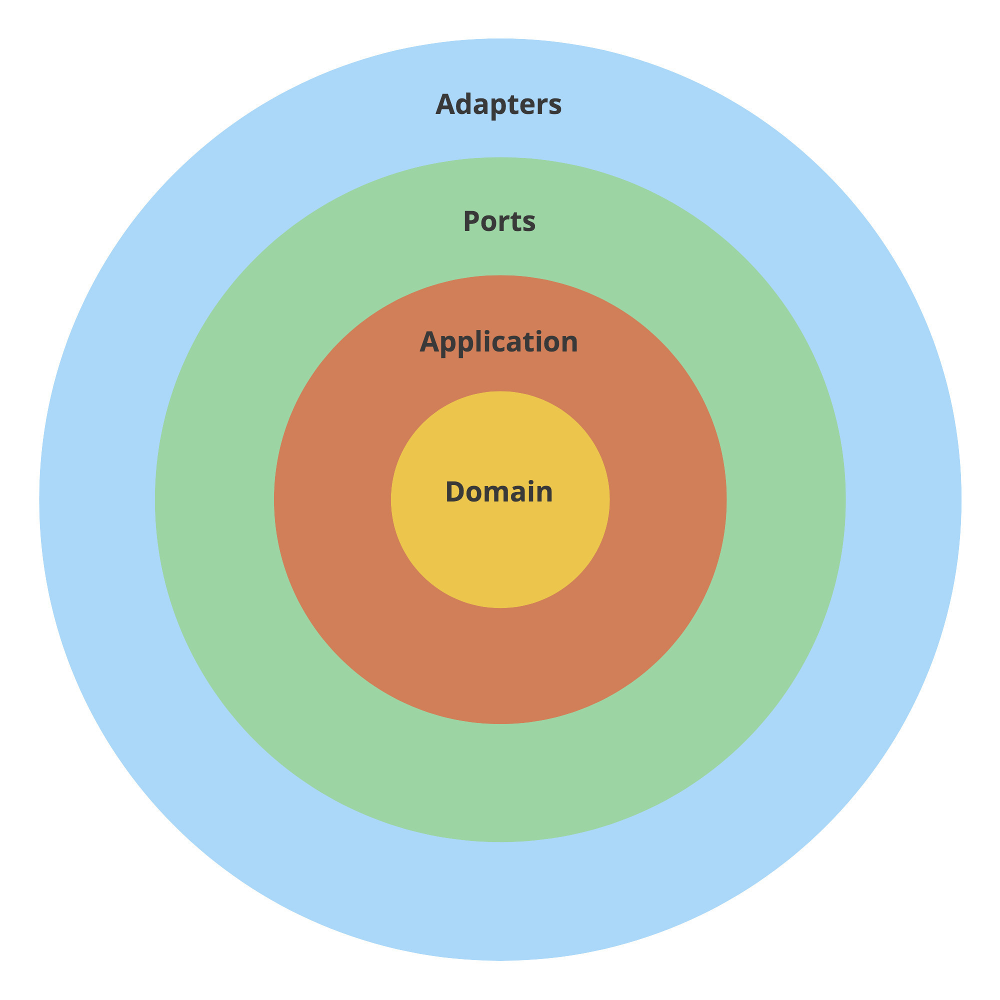

# Paint Calculator

## How to run application ?

- To run application, follow next steps:

```shell
$ docker-compose up
```

## Routes

|        API Path         | Method |                      What it does                       |
|:-----------------------:|:------:|:-------------------------------------------------------:|
| /api/v1/amount-of-paint |  GET   | Calculate the amount of paint needed to paint the walls |

## Curl

```shell
curl --request GET \
  --url http://localhost:8080/api/v1/amount-of-paint \
  --header 'Content-Type: application/json' \
  --data '{
  "walls": [
    {
      "width": 5,
      "height": 5,
      "window_quantity": 1,
      "door_quantity": 1
    },
    {
      "width": 5,
      "height": 5,
      "window_quantity": 1,
      "door_quantity": 1
    },
    {
      "width": 5,
      "height": 5,
      "window_quantity": 1,
      "door_quantity": 1
    },
    {
      "width": 5,
      "height": 5,
      "window_quantity": 1,
      "door_quantity": 1
    }
  ]
}'
```

## Insomnia Collection

> [Insomnia Collection](.insomnia/digitalrepublic.json)

## Tests

- To run tests, follow steps:

``` 
make test/cov
``` 

## Aplication Info Output

| Name          | Size |
|---------------|------|
| ExtraLargeCan | 18L  |
| LargeCan      | 3.6L |
| MediumCan     | 2.5L |
| SmallCan      | 0.5L |

## Architecture Based

**Clean Arch**



## Conclusions

- **I would have implemented a database to expand the architecture but the challenge didn't ask**
- **It was an excellent test**